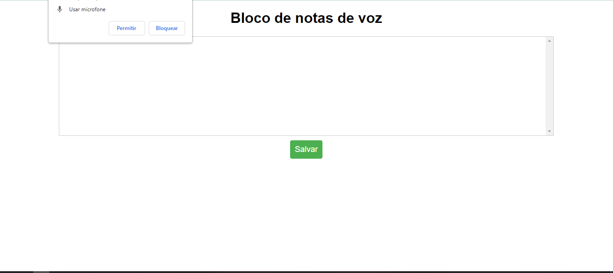
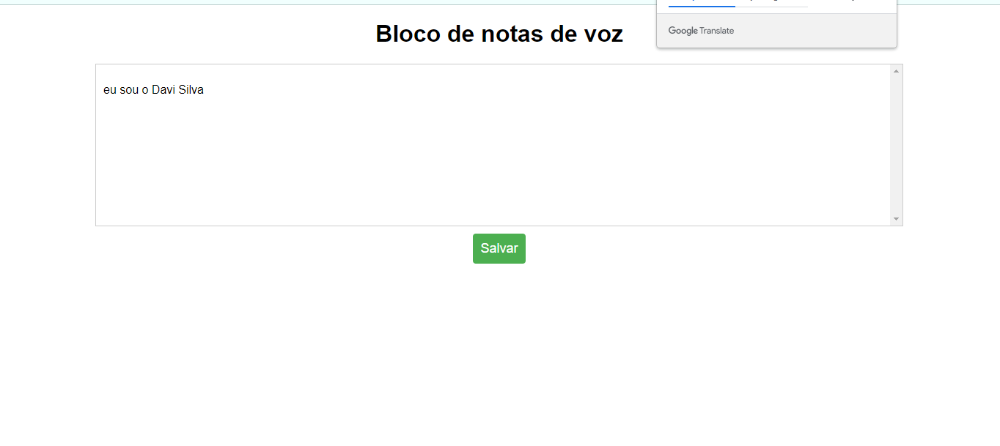

<h1>BlocVoz</h1>

BlocVoz é um projeto que tem como objetivo oferecer uma alternativa mais fácil e intuitiva para a criação e edição de notas em um bloco de notas online. Ao invés de digitar manualmente cada palavra, o usuário pode simplesmente falar e ver o texto ser inserido automaticamente no bloco de notas.

O projeto utiliza a API Web Speech do navegador para fazer o reconhecimento de fala e inserir o texto na tela. Além disso, também possui funcionalidades para salvar as notas criadas e recuperá-las posteriormente.

<h1>Tecnologias utilizadas</h1>

O projeto foi desenvolvido utilizando as seguintes tecnologias:

 
 

<h1>Como executar o projeto</h1>
Para executar o projeto em sua própria máquina, siga os passos abaixo:

Certifique-se de ter o Node.js instalado em sua máquina.
Clone este repositório em sua máquina: git clone https://github.com/<seu-nome-de-usuario>/blocvoz.git
Navegue até o diretório do projeto: cd blocvoz
Instale as dependências do projeto: npm install
Inicie o servidor Node.js: node server.js
Abra o navegador e acesse o endereço http://localhost:3000
Pronto! Agora você pode utilizar o BlocVoz para criar e editar suas notas de forma mais fácil e rápida.

<h1>Contribuições</h1>
Se você gostou do projeto e deseja contribuir ou retribuir de alguma forma, sinta-se à vontade para visitar meu perfil do GitHub e conferir outros projetos interessantes que estou trabalhando atualmente. Além disso, também estou aberto a sugestões, críticas e melhorias para este projeto em particular. Basta abrir uma issue ou enviar um pull request no repositório do projeto. Obrigado!
